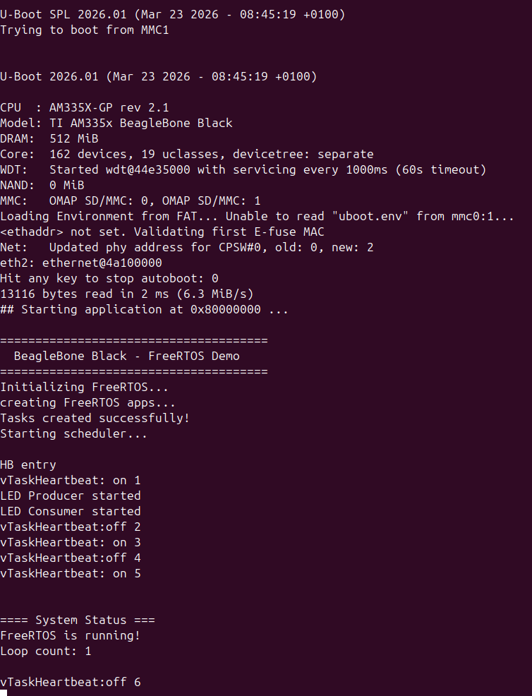

# 🧠 BeagleBone Black --- Bare-Metal examples executing from on-chip SRAM

## Overview
This repository demonstrates full bare-metal bring-up of the TI AM335x
(ARM Cortex‑A8) on the BeagleBone Black running entirely from on‑chip
SRAM without Linux, U‑Boot, or vendor SDKs.

The project includes: 
- Direct GPIO control using MMIO registers 
- Minimal debug UART for early boot logging
- FreeRTOS port running directly on Cortex‑A8 
- Custom linker scripts targeting internal SRAM

This setup mirrors real SoC firmware development workflows used in early
silicon bring‑up, safety firmware, and bootloader stages.

------------------------------------------------------------------------
#  Goals 

## 🎯 Key Features

- SRAM‑only execution (no DDR init required)
- Full startup from reset vector
- Exception vector configuration
- Early UART debug console
- Direct peripheral programming
- Preemptive FreeRTOS scheduling

## 🔬  Intended Learning Outcomes

This project is designed to provide practical understanding of:
- application-class ARM SoC bring-up
- firmware execution before DDR initialization
- RTOS operation on Cortex-A processors
- hardware debugging without OS support
- startup sequence design
- linker-controlled memory layout
------------------------------------------------------------------------
# 🧰  Target Hardware 

- Board: BeagleBone Black
- SoC: TI AM3358
- CPU: ARM Cortex-A8
- Execution memory: On-chip SRAM
- Toolchain: arm-none-eabi-gcc

## 🎯  Why Run From On-Chip SRAM? 

All programs execute from internal SRAM instead of DDR.

Reasons:
- SRAM is available immediately after reset
- avoids the complexity of DDR controller initialization
- simplifies early debugging
- enables deterministic memory layout for RTOS experiments
- matches real silicon bring-up workflows

------------------------------------------------------------------------
# 👨‍💻 Relevance to Real Firmware Development

The techniques shown here closely resemble development performed in:

- SoC boot ROM replacement experiments
- safety island firmware
- trusted execution environments
- early platform initialization layers
- low-level silicon validation
------------------------------------------------------------------------

# Boot Media Selection Overview
The complete initialization sequence of TI AM335x ROM is present in chapter 26 of the Technical reference manual. Below is the brief overview of the bootloader to select the device from which the system boots after reset.
After power-on:

    CPU reset
    → Boot ROM executes
    → SYSBOOT pins sampled
    → Boot device order determined via SYSBOOT pins's status
    → ROM searches for valid boot image
    → Image copied into SRAM
    → Execution jumps to image entry point

All first-stage images are initially loaded into internal SRAM.

## Boot From UART (Serial Boot Mode)

If UART boot mode (Peripheral boot) is selected, the ROM waits for a host(PC) to transmit an image over UART.
The image must be transfered via XMODEM protocol. Refer Firmware Loading (UART XMODEM) section below

------------------------------------------------------------------------

# 📁 Repository Layout 

- bbb_blink/ → Bare‑metal onboard led blink example
- bbb_uart/ → Early debug UART driver
- freertos/ → Cortex‑A8 FreeRTOS port
- common/ → contains driver files user across examples.
- AM335x TRM.pdf/ → TI's AM335x Technical reference manual.
- BBB_SCH.pdf/ → Beaglebone black schematic.

------------------------------------------------------------------------

## ⚙️ Build

You will need an arm compiler to build the projects.

    sudo apt install gcc-arm-none-eabi binutils-arm-none-eabi

Go to individual project and issue:

    make

You will find the .bin,.elf files under build folder generate under individual projects.

For FreeRTOS project, you will have to bring in the freeRTOS kernel submodule via 

    git submodule update--init --recursive 
------------------------------------------------------------------------

## 🔎 Firmware Loading (UART XMODEM)

Connect serial console

    minicom -D /dev/ttyUSB0 -b 115200

- Inside Minicom:

    CTRL+A → S → choose xmodem → select firmware.bin by navigating to the build folder

- Reset the board via power cycling the board or press RESET button.

- After transfer, firmware jumps to entry point in SRAM.

This allows development without JTAG or debugger hardware.

------------------------------------------------------------------------
## 🔎 FREERTOS Loading to DDR

Prepare SD card with a FAT32 partition

Copy uboot and MLO files to the SD card

Copy freeRTOS_app.bin to the same partition along side uboot and MLO files

    u-boot.img
    MLO
    freeRTOS_app.bin

Connect serial console

    minicom -D /dev/ttyUSB0 -b 115200

Insert SD card to BBB and boot from SD card.

See Uboot boot initially and then jumps to FreeRTOS

-   Uboot internally initialize DDR and copies freeRTOS binary to the DDR
-   Uboot jumps to FreeRTOS

------------------------------------------------------------------------

## Demonstrated Low‑Level Concepts

-   ARM Cortex‑A processor modes and exception handling
-   Manual stack initialization per CPU mode
-   Vector relocation and interrupt routing
-   Linker‑controlled memory placement
-   MMIO register programming
-   RTOS context switching
-   UART‑based firmware staging

------------------------------------------------------------------------

## Intended Purpose

This repository is designed for engineers learning:

-   application‑class ARM bring‑up
-   RTOS porting on Cortex‑A processors
-   early firmware execution before OS boot
-   hardware debugging using only UART

------------------------------------------------------------------------
